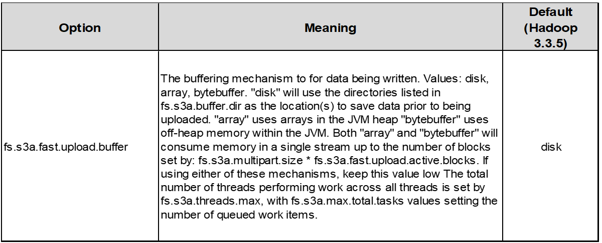

= Ajuste Hadoop S3A
:allow-uri-read: 

El conector S3A de Hadoop facilita la interacción fluida entre aplicaciones basadas en Hadoop y almacenamiento de objetos S3. El ajuste del conector Hadoop S3A es esencial para optimizar el rendimiento cuando se trabaja con el almacenamiento de objetos S3. Antes de entrar en el ajuste de detalles, entendamos lo básico de Hadoop y sus componentes.

== ¿Qué es Hadoop?

* Hadoop * es un potente marco de código abierto diseñado para gestionar el procesamiento y almacenamiento de datos a gran escala. Permite el almacenamiento distribuido y el procesamiento paralelo entre clústeres de equipos.

Los tres componentes principales de Hadoop son:

* *Hadoop HDFS (Hadoop Distributed File System)*: Se encarga del almacenamiento, dividiendo los datos en bloques y distribuyéndolos a través de los nodos.
* *Hadoop MapReduce*: Responsable del procesamiento de datos dividiendo las tareas en fragmentos más pequeños y ejecutándolas en paralelo.
* * Hadoop YARN (Otro Negociador de Recursos):* https://www.simplilearn.com/tutorials/hadoop-tutorial/what-is-hadoop["Gestiona los recursos y programa las tareas de forma eficiente"]

== Hadoop HDFS y conector S3A

HDFS es un componente vital del ecosistema de Hadoop, y tiene un papel crucial en el procesamiento eficiente de Big Data. HDFS permite un almacenamiento y una gestión fiables. Garantiza el procesamiento paralelo y un almacenamiento de datos optimizado, lo que acelera el acceso y el análisis de los datos.

En el procesamiento de Big Data, HDFS ofrece almacenamiento con tolerancia a fallos para grandes conjuntos de datos. Y todo ello gracias a la replicación de datos. Puede almacenar y gestionar grandes volúmenes de datos estructurados y no estructurados en un entorno de almacén de datos. Además, se integra sin problemas con los principales marcos de procesamiento de Big Data, como Apache Spark, Hive, Pig y Flink, lo que permite un procesamiento de datos escalable y eficiente. Es compatible con sistemas operativos basados en Unix (Linux), por lo que es una opción ideal para las organizaciones que prefieren utilizar entornos basados en Linux para su procesamiento de Big Data.

A medida que ha ido creciendo el volumen de datos con el tiempo, el enfoque de añadir nuevas máquinas al clúster Hadoop con sus propios recursos informáticos y de almacenamiento se ha vuelto ineficiente. Escalar de forma lineal crea retos para usar los recursos de forma eficiente y gestionar la infraestructura.

Para abordar estos retos, el conector Hadoop S3A ofrece I/O de alto rendimiento frente al almacenamiento de objetos de S3. Implementar un flujo de trabajo de Hadoop con S3A le ayuda a aprovechar el almacenamiento de objetos como repositorio de datos y le permite separar los recursos informáticos y de almacenamiento, lo que, a su vez, le permite escalar la computación y el almacenamiento de forma independiente. La disociación de la computación y el almacenamiento también le permite dedicar la cantidad adecuada de recursos para sus tareas informáticas y proporcionar capacidad en función del tamaño del conjunto de datos. Por lo tanto, es posible reducir el TCO general para los flujos de trabajo de Hadoop.

== Ajuste de conector Hadoop S3A

S3 se comporta de forma diferente a HDFS, y algunos intentos de preservar la apariencia de un sistema de archivos están excesivamente subóptimos. Es necesario realizar ajustes, pruebas y experimentos cuidadosos para hacer el uso más eficiente de los recursos de S3.

Las opciones de Hadoop incluidas en este documento se basan en Hadoop 3,3.5, consulte https://hadoop.apache.org/docs/r3.3.5/hadoop-project-dist/hadoop-common/core-default.xml["Hadoop 3.3.5 core-site.xml"] para todas las opciones disponibles.

Nota: El valor predeterminado de algunas configuraciones de Hadoop fs.S3A es diferente en cada versión de Hadoop. Asegúrese de consultar el valor predeterminado específico de su versión actual de Hadoop. Si no se especifica esta configuración en Hadoop core-site.xml, se utilizará el valor predeterminado. Puede anular el valor en tiempo de ejecución con las opciones de configuración de Spark o Hive.

Tienes que ir a esto https://netapp.sharepoint.com/sites/StorageGRIDTME/Shared%20Documents/General/Partners/Dremio/SG%20data%20lake%20TR/Apache%20Hadoop%20Amazon%20Web%20Services%20support%20–%20Maximizing%20Performance%20when%20working%20with%20the%20S3A%20Connector["Página de Apache Hadoop"] para entender cada opción fs.s3a. Si es posible, pruébalos en un clúster Hadoop que no sea de producción para encontrar los valores óptimos.

Deberías leer https://hadoop.apache.org/docs/stable/hadoop-aws/tools/hadoop-aws/performance.html["Maximizar el rendimiento cuando se trabaja con el conector S3A"] para otras recomendaciones de ajuste.

Veamos algunas consideraciones clave:

*1. Compresión de datos*

No active la compresión StorageGRID. La mayoría de los sistemas de Big Data utilizan un rango de bytes GET en lugar de recuperar todo el objeto. El uso de un rango de bytes GET con objetos comprimidos reduce considerablemente el rendimiento GET.

*2. S3A comités*

En general, Magic S3A committer se recomienda. Consulte este apartado https://hadoop.apache.org/docs/current/hadoop-aws/tools/hadoop-aws/committers.html#Common_S3A_Committer_Options["Página de opciones comunes de S3A committer"] para obtener una mejor comprensión de magic committer y sus configuraciones s3a relacionadas.

Responsable de Magic:

El Magic committer confía específicamente en S3Guard para ofrecer listados de directorios consistentes en el almacén de objetos de S3.

Con S3 consistente (que ahora es el caso), el comensor Magic se puede usar de forma segura con cualquier cubo S3.

Opciones y experimentación:

En función de su caso de uso, puede elegir entre el comité de almacenamiento provisional (que se basa en un sistema de archivos HDFS del clúster) y el comité mágico.

Experimente con ambos para determinar cuál se adapta mejor a su carga de trabajo y sus requisitos.

En resumen, los Comités S3A ofrecen una solución al desafío fundamental de un compromiso de producción consistente, de alto rendimiento y fiable con S3. Su diseño interno garantiza una transferencia de datos eficiente al tiempo que mantiene la integridad de los datos.

image:../media/s3a-tuning/image1.png["S3A Tabla de opciones"]

*3. Thread, tamaños de pool de conexiones y tamaño de bloque*

* Cada cliente *S3A* que interactúa con un solo depósito tiene su propio conjunto dedicado de conexiones HTTP 1,1 abiertas e hilos para las operaciones de carga y copia.
* https://hadoop.apache.org/docs/stable/hadoop-aws/tools/hadoop-aws/performance.html["Puede ajustar estos tamaños de pool para lograr un equilibrio entre el rendimiento y el uso de memoria/thread"].
* Al cargar datos a S3, se divide en bloques. El tamaño de bloque predeterminado es de 32 MB. Puede personalizar este valor configurando la propiedad fs.S3A.block.size.
* Los bloques mayores pueden mejorar el rendimiento de las cargas de datos grandes al reducir la sobrecarga que supone gestionar piezas de varias partes durante la carga. El valor recomendado es de 256 MB o superior para un conjunto de datos grande.

image:../media/s3a-tuning/image2.png["S3A Tabla de opciones"]

*4. Carga multiparte*

Los responsables de S3A *SIEMPRE* usan MPU (carga multiparte) para cargar datos al cubo S3. Esto es necesario para permitir: Fallo de tarea, ejecución especulativa de tareas y abortos de trabajo antes de la confirmación. A continuación se indican algunas especificaciones clave relacionadas con las cargas de varias partes:

* Tamaño máximo de objeto: 5 TiB (terabytes).
* Número máximo de piezas por carga: 10.000.
* Números de referencia: Desde 1 hasta 10.000 (inclusive).
* Tamaño de la pieza: Entre 5 MiB y 5 GiB. Cabe destacar que no hay límite de tamaño mínimo para la última parte de la carga de varias partes.

El uso de un tamaño de pieza más pequeño para cargas de varias partes S3 tiene ventajas y desventajas.

*Ventajas*:

* Recuperación rápida de problemas de red: Al cargar piezas más pequeñas, se minimiza el impacto de reiniciar una carga fallida debido a un error de red. Si una pieza falla, solo necesita volver a cargar esa pieza específica en lugar de todo el objeto.
* Mejor Paralelización: Se pueden subir más partes en paralelo, aprovechando las conexiones multi-threading o concurrentes. Esta paralelización mejora el rendimiento, sobre todo cuando se trata de archivos grandes.

*Desventaja*:

* Sobrecarga de red: El tamaño de la pieza más pequeño significa más partes para cargar, cada parte requiere su propia solicitud HTTP. Más solicitudes HTTP aumentan la sobrecarga de iniciar y completar solicitudes individuales. La gestión de un gran número de piezas pequeñas puede afectar al rendimiento.
* Complejidad: Gestionar el pedido, realizar un seguimiento de las piezas y garantizar que las cargas sean satisfactorias puede resultar engorroso. Si es necesario anular la carga, se debe realizar un seguimiento y depurar todos los artículos que ya se han cargado.

Para Hadoop, se recomienda un tamaño de pieza de 256MB o superior para fs.S3A.multipart.size. Defina siempre el valor fs.S3A.mutlipart.threshold en 2 x fs.S3A.multipart.size. Por ejemplo, si fs.S3A.multipart.size = 256M, fs.S3A.mutlipart.threshold debe ser 512M.

Utilice un tamaño de pieza más grande para un conjunto de datos grande. Es importante elegir un tamaño de pieza que equilibre estos factores en función de su caso de uso específico y las condiciones de red.

Una carga de varias partes es un https://docs.aws.amazon.com/AmazonS3/latest/dev/mpuoverview.html?trk=el_a134p000006vpP2AAI&trkCampaign=AWSInsights_Website_Docs_AmazonS3-dev-mpuoverview&sc_channel=el&sc_campaign=AWSInsights_Blog_discovering-and-deleting-incomplete-multipart-uploads-to-lower-&sc_outcome=Product_Marketing["proceso de tres pasos"]:

. Se inicia la carga, StorageGRID devuelve un ID de carga.
. Las partes del objeto se cargan mediante el identificador de carga.
. Una vez que se han cargado todas las partes del objeto, envía una solicitud de carga completa de varias partes con upload-id. StorageGRID construye el objeto a partir de las piezas cargadas, y el cliente puede acceder al objeto.

Si la solicitud completa de carga de varias partes no se envía correctamente, las piezas permanecen en StorageGRID y no crearán ningún objeto. Esto ocurre cuando los trabajos se interrumpen, fallan o se anulan. Los artículos permanecen en la cuadrícula hasta que la carga de varias partes se completa o se anula o StorageGRID depura estos artículos si han transcurrido 15 días desde que se inició la carga. Si hay muchas (unos pocos cientos de miles o millones) cargas multiparte en curso en un depósito, cuando Hadoop envía «lista-multiparte-cargas» (esta solicitud no filtra por identificador de carga), la solicitud puede tardar mucho tiempo en completarse o eventualmente en agotarse. Puede considerar establecer fs.S3A.mutlipart.purge en true con un valor fs.S3A.multipart.purge.age apropiado (por ejemplo, 5 a 7 días, no utilice el valor predeterminado de 86400, es decir, 1 día). O póngase en contacto con el servicio de soporte de NetApp para investigar la situación.

image:../media/s3a-tuning/image3.png["S3A Tabla de opciones"]

*5. Buffer escribe datos en la memoria*

Para mejorar el rendimiento, puede almacenar en búfer los datos de escritura en la memoria antes de cargarlos en S3. Esto puede reducir el número de escrituras pequeñas y mejorar la eficiencia.

Recuerda que S3 y HDFS funcionan de distintas maneras. Es necesario realizar un ajuste/prueba/experimento cuidadoso para hacer el uso más eficiente de los recursos de S3.
