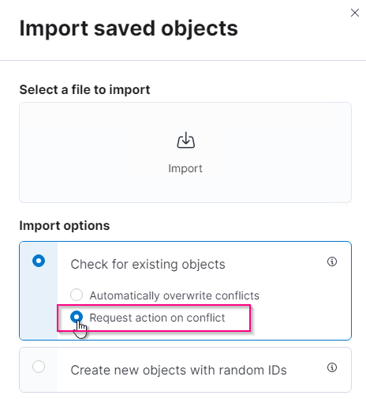
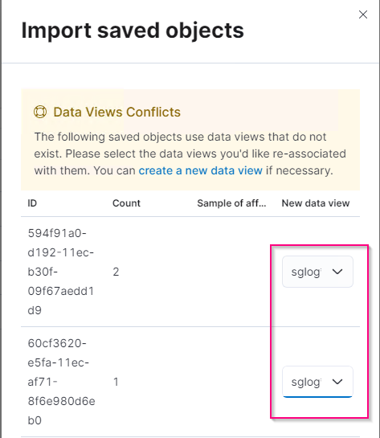

= Análisis de registros de StorageGRID mediante pila ELK
:allow-uri-read: 

_Angela Cheng_

[role="lead"]
Con la función syslog Forward de StorageGRID 11.6, es posible configurar un servidor de syslog externo para recopilar y analizar mensajes de registro de StorageGRID. ELK (Elasticsearch, Logstash, Kibana) se ha convertido en una de las soluciones de análisis de registros más populares. Vea el https://www.netapp.tv/details/29396["Análisis de registros de StorageGRID mediante vídeo ELK"] Para ver una configuración DE EJEMPLO DE ELK y cómo se puede utilizar para identificar y solucionar las solicitudes fallidas de S3. Este artículo proporciona archivos de ejemplo de configuración de Logstash, consultas de Kibana, gráficos y panel para ofrecerle un inicio rápido para la gestión de registros y análisis de StorageGRID.

== Requisitos

* StorageGRID 11.6.0.2 o superior
* ELK (Elasticsearch, Logstash y Kibana) 7.1x o superior instalado y en funcionamiento

== Archivos de ejemplo

* link:../media/elk-config/elk7-sample.zip["Descargue el paquete de archivos de ejemplo Logstash 7.x."] + *md5 checksum* 148c23d0021d9a4bb4a6c0287464deab + *sha256 checksum* f51ec9e2e3f842d5a7861566b167a561b4373b4e7bb3c8b3b3b3b3b3b3b3b3b3b3b3b3b3b3b3b3b3b3b5
* link:../media/elk-config/elk8-sample.zip["Descargue el paquete de archivos de ejemplo Logstash 8.x."] + *md5 checksum* e11bae3a662f87c310ef363d0fe06835 + *sha256 checksum* 5c670755742cfdfd5aa7a596ba087e0153a65bcaef3934afdb682f6cd1278d

== Suposición

Los lectores están familiarizados con la terminología y las operaciones de StorageGRID y ELK.

== Instrucción

Se proporcionan dos versiones de ejemplo debido a diferencias en los nombres definidos por patrones de gruñido. + por ejemplo, el patrón de grok SYSLOGBASE en el archivo de configuración Logstash define los nombres de campo de forma diferente dependiendo de la versión de Logstash instalada.

[listing]
----
match => {"message" => '<%{POSINT:syslog_pri}>%{SYSLOGBASE} %{GREEDYDATA:msg-details}'}
----
*Muestra de Logstash 7.17*

image::../media/elk-config/logstash-7.17.fields-sample.png[Muestra Logstash 7.17]

*Muestra de Logstash 8.23*

image::../media/elk-config/logstash-8.x.fields-sample.png[Muestra Logstash 8.23]

* Pasos*

. Descomprima el ejemplo proporcionado en función de la versión DE ELK instalada. + la carpeta de ejemplo incluye dos muestras de configuración de Logstash: + *sglog-2-file.conf:* este archivo de configuración envía mensajes de registro StorageGRID a un archivo en Logstash sin transformación de datos. Puede utilizar esta opción para confirmar que Logstash recibe mensajes de StorageGRID o para comprender los patrones de registro de StorageGRID. + *sglog-2-es.conf:* este archivo de configuración transforma los mensajes de registro StorageGRID utilizando varios patrones y filtros. Incluye ejemplos de sentencias DROP, que devuelven mensajes basados en patrones o filtros. La salida se envía a Elasticsearch para indizar. + Personalice el archivo de configuración seleccionado de acuerdo con la instrucción dentro del archivo.
. Pruebe el archivo de configuración personalizado:
+
[listing]
----
/usr/share/logstash/bin/logstash --config.test_and_exit -f <config-file-path/file>
----
+
Si la última línea devuelta es similar a la siguiente, el archivo de configuración no tiene errores de sintaxis:

+
[listing]
----
[LogStash::Runner] runner - Using config.test_and_exit mode. Config Validation Result: OK. Exiting Logstash
----
. Copie el archivo conf personalizado en la configuración del servidor Logstash: /Etc/logstash/conf.d + Si no ha habilitado config.reload.automatic en /etc/logstash/logstash.yml, reinicie el servicio Logstash. De lo contrario, espere a que transcurra el intervalo de recarga de la configuración.
+
[listing]
----
 grep reload /etc/logstash/logstash.yml
# Periodically check if the configuration has changed and reload the pipeline
config.reload.automatic: true
config.reload.interval: 5s
----
. Compruebe /var/log/logstash/logstash-plain.log y confirme que no hay errores al iniciar Logstash con el nuevo archivo de configuración.
. Confirme que el puerto TCP se ha iniciado y que está escuchando. + en este ejemplo, se utiliza el puerto TCP 5000.
+
[listing]
----
netstat -ntpa | grep 5000
tcp6       0      0 :::5000                 :::*                    LISTEN      25744/java
----
. Desde la interfaz gráfica de usuario del administrador StorageGRID, configure el servidor de syslog externo para que envíe mensajes de registro a Logstash. Consulte la https://www.netapp.tv/details/29396["vídeo de demostración"] para obtener más detalles.
. Debe configurar o deshabilitar el firewall en el servidor Logstash para permitir la conexión de nodos StorageGRID al puerto TCP definido.
. En la interfaz gráfica de usuario de Kibana, seleccione Management -> Dev Tools. En la página Console, ejecute este comando GET para confirmar que se han creado nuevos índices en Elasticsearch.
+
[listing]
----
GET /_cat/indices/*?v=true&s=index
----
. Desde la GUI de Kibana, cree un patrón de índice (ELK 7.x) o una vista de datos (ELK 8.x).
. En la GUI de Kibana, escriba "objetos afeitados" en el cuadro de búsqueda que se encuentra en el centro superior. + en la página objetos guardados, seleccione Importar. En Opciones de importación, seleccione "solicitar acción en conflicto"
+

+
Importe eleLIMPORT <version>-QUERY-chart-sample.ndjson. + cuando se le solicite que resuelva el conflicto, seleccione el patrón de índice o la vista de datos que creó en el paso 8.

+

+
Se importan los siguientes objetos de Kibana: + *Consulta* + * audit-msg-s3rq-orlm + * mensajes relacionados con bycast log s3 + * advertencia de nivel de registro o superior + * evento de seguridad fallido + *Gráfico* + * las solicitudes s3 cuentan en función de bycast.log + * código de estado HTTP + * desglose de msg de auditoría por tipo + * respuesta media de s3 Tiempo + *Panel* + * panel de solicitudes S3 utilizando los gráficos anteriores.

Ahora está listo para realizar el análisis de registros de StorageGRID con Kibana.

== Recursos adicionales

* https://coralogix.com/blog/syslog-101-everything-you-need-to-know-to-get-started/["syslog101"]
* https://www.elastic.co/what-is/elk-stack["¿Qué es LA pila ELK"]
* https://github.com/hpcugent/logstash-patterns/blob/master/files/grok-patterns["Lista de patrones GROK"]
* https://logz.io/blog/logstash-grok/["Guía para principiantes de Logstash: GROK"]
* https://coralogix.com/blog/a-practical-guide-to-logstash-syslog-deep-dive/["Una guía práctica para Logstash: Syslog profundizar"]
* https://www.elastic.co/guide/en/kibana/master/document-explorer.html["Guía de Kibana: Explorar el documento"]
* https://docs.netapp.com/us-en/storagegrid-116/audit/index.html["Referencia de mensajes de registro de auditoría de StorageGRID"]

