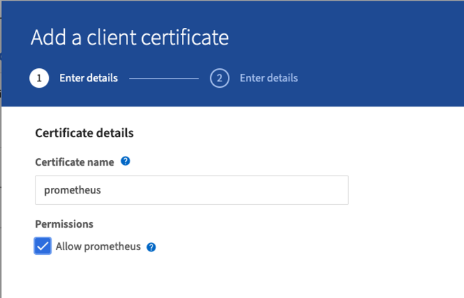
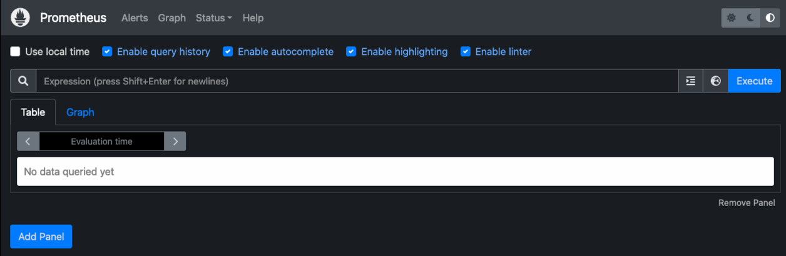
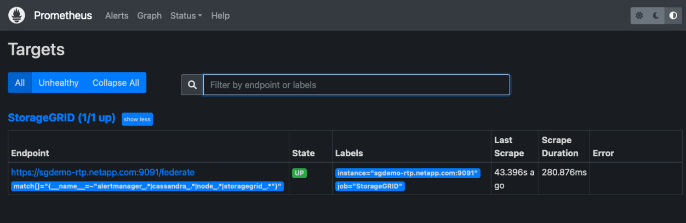
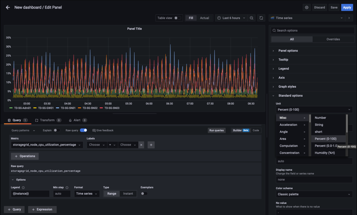
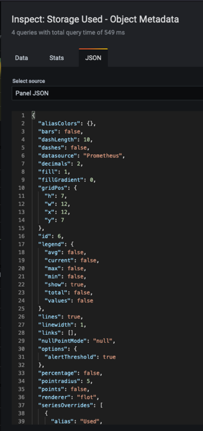

= Utilice Prometheus y Grafana para ampliar la retención de métricas
:allow-uri-read: 

_Aron Klein_

[role="lead"]
En este informe técnico, se proporcionan instrucciones detalladas para la configuración de NetApp StorageGRID 11.6 con servicios externos Prometheus y Grafana.

== Introducción

StorageGRID almacena métricas mediante Prometheus y proporciona visualizaciones de estas métricas a través de los paneles de Grafana integrados. Se puede acceder a las métricas de Prometheus de manera segura desde StorageGRID mediante la configuración de certificados de acceso de clientes y la habilitación del acceso a prometheus para el cliente especificado. Hoy en día, la retención de estos datos métricos está limitada por la capacidad de almacenamiento del nodo de administración. Para obtener una mayor duración y una capacidad para crear visualizaciones personalizadas de estas métricas, implementaremos un nuevo servidor Prometheus y Grafana, configuraremos nuestro nuevo servidor para reunir las métricas de la instancia de StorageGRIDs y creamos un panel con las métricas que somos importantes para nosotros. Puede obtener más información sobre las métricas de Prometheus recopiladas en el https://docs.netapp.com/us-en/storagegrid-116/monitor/commonly-used-prometheus-metrics.html["Documentación de StorageGRID"^].

== Federar Prometheus

=== Detalles del laboratorio

A efectos de este ejemplo, usaré todas las máquinas virtuales para nodos StorageGRID 11.6 y un servidor Debian 11. La interfaz de gestión StorageGRID se configura con un certificado de CA de confianza pública. Este ejemplo no pasará por la instalación y configuración del sistema StorageGRID o la instalación de Debian linux. Puede utilizar cualquier sabor de Linux que desee, con el apoyo de Prometheus y Grafana. Tanto Prometheus como Grafana pueden instalar como contenedores Docker, crear a partir de código fuente o binarios precompilados. En este ejemplo, instalaré los binarios Prometheus y Grafana directamente en el mismo servidor Debian. Descargue y siga las instrucciones de instalación básica de https://prometheus.io[] y.. https://grafana.com/grafana/[] respectivamente.

=== Configure StorageGRID para el acceso de Prometheus Client

Para poder acceder a las métricas de prometheus almacenadas de StorageGRID, debe generar o cargar un certificado de cliente con clave privada y habilitar el permiso para el cliente. La interfaz de gestión de StorageGRID debe tener un certificado SSL. El servidor prometheus debe confiar en este certificado mediante una CA de confianza o de forma manual si se firma automáticamente. Para leer más, visite la https://docs.netapp.com/us-en/storagegrid-116/admin/configuring-administrator-client-certificates.html["Documentación de StorageGRID"].

. En la interfaz de gestión StorageGRID, seleccione "CONFIGURACIÓN" en la parte inferior izquierda y, en la segunda columna de "Seguridad", haga clic en certificados.
. En la página certificados, seleccione la ficha "Cliente" y haga clic en el botón "Agregar".
. Proporcione un nombre para el cliente al que se le otorgará acceso y que utilice este certificado. Haga clic en la casilla de "permisos", delante de "permitir Prometheus" y haga clic en el botón continuar.
+

. Si tiene un certificado firmado por CA, puede seleccionar el botón de opción "cargar certificado", pero en nuestro caso vamos a dejar que StorageGRID genere el certificado de cliente seleccionando el botón de opción "generar certificado". Los campos obligatorios se mostrarán para rellenar. Introduzca el FQDN del servidor cliente, la IP del servidor, el asunto y los días válidos. A continuación, haga clic en el botón "generar".
+
image::../media/prometheus/cert_detail.png[detalles del certificado]

[NOTE]
====
 Be mindful of the certificate days valid entry as you will need to renew this certificate in both StorageGRID and the Prometheus server before it expires to maintain uninterrupted collection.
====
. Descargue el archivo pem del certificado y el archivo pem de la clave privada.
+
image::../media/prometheus/cert_download.png[descarga del certificado]

[NOTE]
====
 This is the only time you can download the private key, so make sure you do not skip this step.
====

=== Preparar el servidor Linux para la instalación de Prometheus

Antes de instalar Prometheus, quiero preparar mi entorno con un usuario Prometheus, la estructura de directorio y configurar la capacidad para la ubicación del almacenamiento de métricas.

. Cree el usuario Prometheus.
+
[source, console]
----
sudo useradd -M -r -s /bin/false Prometheus
----
. Crear los directorios de Prometheus, certificado de cliente y datos de métricas.
+
[source, console]
----
sudo mkdir /etc/Prometheus /etc/Prometheus/cert /var/lib/Prometheus
----
. He formateado el disco que estoy usando para la retención de métricas con un sistema de archivos ext4.
+
[listing]
----
mkfs -t ext4 /dev/sdb
----
. A continuación, he montado el sistema de archivos en el directorio de métricas Prometheus.
+
[listing]
----
sudo mount -t auto /dev/sdb /var/lib/prometheus/
----
. Obtenga el UUID del disco que utiliza para los datos de métricas.
+
[listing]
----
sudo ls -al /dev/disk/by-uuid/
   lrwxrwxrwx 1 root root   9 Aug 18 17:02 9af2c5a3-bfc2-4ec1-85d9-ebab850bb4a1 -> ../../sdb
----
. Agregar una entrada en /etc/fstab/ haciendo que el montaje persista en reinicios utilizando el UUID de /dev/sdb.
+
[listing]
----
/etc/fstab
UUID=9af2c5a3-bfc2-4ec1-85d9-ebab850bb4a1 /var/lib/prometheus	ext4	defaults	0	0
----

=== Instalar y configurar Prometheus

Ahora que el servidor está listo, puedo iniciar la instalación de Prometheus y configurar el servicio.

. Extraiga el paquete de instalación Prometheus
+
[source, console]
----
tar xzf prometheus-2.38.0.linux-amd64.tar.gz
----
. Copie los archivos binarios en /usr/local/bin y cambie la propiedad al usuario prometheus creado anteriormente
+
[source, console]
----
sudo cp prometheus-2.38.0.linux-amd64/{prometheus,promtool} /usr/local/bin
sudo chown prometheus:prometheus /usr/local/bin/{prometheus,promtool}
----
. Copie las consolas y bibliotecas en /etc/prometheus
+
[source, console]
----
sudo cp -r prometheus-2.38.0.linux-amd64/{consoles,console_libraries} /etc/prometheus/
----
. Copie el certificado de cliente y los archivos de pem de claves privadas descargados anteriormente de StorageGRID a /etc/prometheus/certs
. Cree el archivo yaml de configuración de prometheus
+
[source, console]
----
sudo nano /etc/prometheus/prometheus.yml
----
. Inserte la siguiente configuración. El nombre del trabajo puede ser cualquier cosa que desee. Cambie el "-Targets: ['']" al FQDN del nodo admin y, si modificó los nombres del certificado y los nombres de los archivos de claves privadas, actualice la sección tls_config para que coincida. a continuación, guarde el archivo. Si la interfaz de gestión de grid utiliza un certificado autofirmado, descargue el certificado y colóquelo con el certificado de cliente con un nombre único, y en la sección tls_config añada CA_file: /Etc/prometheus/cert/UIcert.pem
+
.. En este ejemplo estoy recopilando todas las métricas que empiezan con alertManager, cassandra, nodo y StorageGRID. Puede ver más información sobre la métrica Prometheus en la https://docs.netapp.com/us-en/storagegrid-116/monitor/commonly-used-prometheus-metrics.html["Documentación de StorageGRID"^].
+
[source, yaml]
----
# my global config
global:
  scrape_interval: 60s # Set the scrape interval to every 15 seconds. Default is every 1 minute.

scrape_configs:
  - job_name: 'StorageGRID'
    honor_labels: true
    scheme: https
    metrics_path: /federate
    scrape_interval: 60s
    scrape_timeout: 30s
    tls_config:
      cert_file: /etc/prometheus/cert/certificate.pem
      key_file: /etc/prometheus/cert/private_key.pem
    params:
      match[]:
        - '{__name__=~"alertmanager_.*|cassandra_.*|node_.*|storagegrid_.*"}'
    static_configs:
    - targets: ['sgdemo-rtp.netapp.com:9091']
----

[NOTE]
====
Si la interfaz de gestión de grid utiliza un certificado autofirmado, descargue el certificado y colóquelo con el certificado de cliente con un nombre único. En la sección tls_config, agregue el certificado encima del certificado de cliente y las líneas de clave privada

....
        ca_file: /etc/prometheus/cert/UIcert.pem
....
====
. Cambie la propiedad de todos los archivos y directorios en /etc/prometheus y /var/lib/prometheus al usuario prometheus
+
[source, console]
----
sudo chown -R prometheus:prometheus /etc/prometheus/
sudo chown -R prometheus:prometheus /var/lib/prometheus/
----
. Cree un archivo de servicio prometheus en /etc/systemd/system
+
[source, console]
----
sudo nano /etc/systemd/system/prometheus.service
----
. Inserte las siguientes líneas, observe el #--Storage.tsdb.retention.time=1 año# que establece la retención de los datos de la métrica en 1 año. También puede usar #--Storage.tsdb.retention.size=300GIB# para basar la retención en los límites de almacenamiento. Esta es la única ubicación donde se establece la retención de las métricas.
+
[source, console]
----
[Unit]
Description=Prometheus Time Series Collection and Processing Server
Wants=network-online.target
After=network-online.target

[Service]
User=prometheus
Group=prometheus
Type=simple
ExecStart=/usr/local/bin/prometheus \
        --config.file /etc/prometheus/prometheus.yml \
        --storage.tsdb.path /var/lib/prometheus/ \
        --storage.tsdb.retention.time=1y \
        --web.console.templates=/etc/prometheus/consoles \
        --web.console.libraries=/etc/prometheus/console_libraries

[Install]
WantedBy=multi-user.target
----
. Vuelva a cargar el servicio systemd para registrar el nuevo servicio prometheus. a continuación, inicie y habilite el servicio prometheus.
+
[source, console]
----
sudo systemctl daemon-reload
sudo systemctl start prometheus
sudo systemctl enable prometheus
----
. Compruebe que el servicio está funcionando correctamente
+
[source, console]
----
sudo systemctl status prometheus
----
+
[listing]
----
● prometheus.service - Prometheus Time Series Collection and Processing Server
     Loaded: loaded (/etc/systemd/system/prometheus.service; enabled; vendor preset: enabled)
     Active: active (running) since Mon 2022-08-22 15:14:24 EDT; 2s ago
   Main PID: 6498 (prometheus)
      Tasks: 13 (limit: 28818)
     Memory: 107.7M
        CPU: 1.143s
     CGroup: /system.slice/prometheus.service
             └─6498 /usr/local/bin/prometheus --config.file /etc/prometheus/prometheus.yml --storage.tsdb.path /var/lib/prometheus/ --web.console.templates=/etc/prometheus/consoles --web.con>

Aug 22 15:14:24 aj-deb-prom01 prometheus[6498]: ts=2022-08-22T19:14:24.510Z caller=head.go:544 level=info component=tsdb msg="Replaying WAL, this may take a while"
Aug 22 15:14:24 aj-deb-prom01 prometheus[6498]: ts=2022-08-22T19:14:24.816Z caller=head.go:615 level=info component=tsdb msg="WAL segment loaded" segment=0 maxSegment=1
Aug 22 15:14:24 aj-deb-prom01 prometheus[6498]: ts=2022-08-22T19:14:24.816Z caller=head.go:615 level=info component=tsdb msg="WAL segment loaded" segment=1 maxSegment=1
Aug 22 15:14:24 aj-deb-prom01 prometheus[6498]: ts=2022-08-22T19:14:24.816Z caller=head.go:621 level=info component=tsdb msg="WAL replay completed" checkpoint_replay_duration=55.57µs wal_rep>
Aug 22 15:14:24 aj-deb-prom01 prometheus[6498]: ts=2022-08-22T19:14:24.831Z caller=main.go:997 level=info fs_type=EXT4_SUPER_MAGIC
Aug 22 15:14:24 aj-deb-prom01 prometheus[6498]: ts=2022-08-22T19:14:24.831Z caller=main.go:1000 level=info msg="TSDB started"
Aug 22 15:14:24 aj-deb-prom01 prometheus[6498]: ts=2022-08-22T19:14:24.831Z caller=main.go:1181 level=info msg="Loading configuration file" filename=/etc/prometheus/prometheus.yml
Aug 22 15:14:24 aj-deb-prom01 prometheus[6498]: ts=2022-08-22T19:14:24.832Z caller=main.go:1218 level=info msg="Completed loading of configuration file" filename=/etc/prometheus/prometheus.y>
Aug 22 15:14:24 aj-deb-prom01 prometheus[6498]: ts=2022-08-22T19:14:24.832Z caller=main.go:961 level=info msg="Server is ready to receive web requests."
Aug 22 15:14:24 aj-deb-prom01 prometheus[6498]: ts=2022-08-22T19:14:24.832Z caller=manager.go:941 level=info component="rule manager" msg="Starting rule manager..."
----
. Ahora debe poder acceder a la interfaz de usuario de su servidor prometheus http://Prometheus-server:9090[] Y ver la interfaz de usuario
+

. En "Estado", puede ver el estado del extremo StorageGRID que hemos configurado en prometheus.yml
+
image::../media/prometheus/prometheus_targets.png[menú de estado de prometheus]

+

. En la página Graph, puede ejecutar una consulta de prueba y comprobar que los datos se están raspando correctamente. Por ejemplo, introduzca "storagegrid_node_cpu_Utilization_porcentual" en la barra de consultas y haga clic en el botón Execute.
+
image::../media/prometheus/prometheus_execute.png[ejecución de la consulta prometheus]

== Instalar y configurar Grafana

Ahora que prometheus está instalado y en funcionamiento, podemos pasar a la instalación de Grafana y configurar una consola

=== Grafana Instalation

. Instale la última edición empresarial de Grafana
+
[source, console]
----
sudo apt-get install -y apt-transport-https
sudo apt-get install -y software-properties-common wget
sudo wget -q -O /usr/share/keyrings/grafana.key https://packages.grafana.com/gpg.key
----
. Añada este repositorio para versiones estables:
+
[source, console]
----
echo "deb [signed-by=/usr/share/keyrings/grafana.key] https://packages.grafana.com/enterprise/deb stable main" | sudo tee -a /etc/apt/sources.list.d/grafana.list
----
. Después de agregar el repositorio.
+
[source, console]
----
sudo apt-get update
sudo apt-get install grafana-enterprise
----
. Vuelva a cargar el servicio systemd para registrar el nuevo servicio grafana. A continuación, inicie y habilite el servicio Grafana.
+
[source, console]
----
sudo systemctl daemon-reload
sudo systemctl start grafana-server
sudo systemctl enable grafana-server.service
----
. Grafana ya está instalado y en funcionamiento. Cuando abra un navegador a HTTP://Prometheus-Server:3000 recibirá la página de inicio de sesión de Grafana.
. Las credenciales de inicio de sesión predeterminadas son admin/admin, y debe configurar una contraseña nueva cuando le solicite.

=== Cree un panel de Grafana para StorageGRID

Con Grafana y Prometheus instalados y en ejecución, ahora es hora de conectar los dos mediante la creación de un origen de datos y la creación de un panel

. En el panel izquierdo, expanda "Configuración" y seleccione "orígenes de datos" y, a continuación, haga clic en el botón "Agregar origen de datos"
. Prometheus será una de las principales fuentes de datos entre las que elegir. Si no lo es, utilice la barra de búsqueda para localizar "Prometheus"
. Para configurar el origen Prometheus, introduzca la URL de la instancia prometheus y el intervalo de raspado para que coincidan con el intervalo Prometheus. También he deshabilitado la sección de alertas, ya que no configuré el administrador de alertas en prometheus.
+
image::../media/prometheus/grafana_prometheus_conf.png[configuración de grafana prometheus]

. Con la configuración deseada introducida, desplácese hacia abajo hasta la parte inferior y haga clic en "Guardar y probar"
. Una vez que la prueba de configuración se haya realizado correctamente, haga clic en el botón explorar.
+
.. En la ventana explorar, puede utilizar la misma métrica que probamos Prometheus con "storagegrid_node_cpu_Utilization_porcentual" y hacer clic en el botón "Ejecutar consulta"
+
image::../media/prometheus/grafana_source_explore.png[exploración de métricas de grafana prometheus]

. Ahora que tenemos configurado el origen de datos, podemos crear un panel de control.
+
.. En el panel izquierdo, expanda "Paneles" y seleccione "+ New Dashboard".
.. Seleccione "Añadir un nuevo panel"
.. Configure el nuevo panel seleccionando una métrica, de nuevo utilizaré "storagegrid_node_cpu_Utilization_Percent", Introduzca un título para el panel, expanda "Opciones" en la parte inferior y para que la leyenda cambie a personalizado e introduzca "{{Instance}" para definir los nombres de los nodos y, en el panel derecho, en "Opciones estándar", defina "Unidad" en "Misc-100). A continuación, haga clic en "aplicar" para guardar el panel en el tablero de a bordo.
+

. Podríamos seguir desarrollando nuestro panel de control como este para cada métrica que deseamos, pero por suerte StorageGRID ya dispone de paneles con paneles que podemos copiar en nuestros paneles personalizados.
+
.. En el panel izquierdo de la interfaz de gestión de StorageGRID, seleccione «Soporte» y, en la parte inferior de la columna «Herramientas», haga clic en «Métricas».
.. Dentro de las métricas, voy a seleccionar el enlace "Grid" en la parte superior de la columna central.
+
image::../media/prometheus/storagegrid_metrics.png[Métricas de StorageGRID]

.. En el panel de cuadrícula, permite seleccionar el panel "almacenamiento usado - metadatos de objeto". Haga clic en la flecha abajo y en el final del título del panel para ver un menú desplegable. En este menú, seleccione "inspeccionar" y "Panel JSON".
+
image::../media/prometheus/storagegrid_dashboard_insp.png[Consola de StorageGRID]

.. Copie el código JSON y cierre la ventana.
+

.. En nuestro nuevo panel, haga clic en el icono para añadir un nuevo panel.
+
image::../media/prometheus/grafana_add_panel.png[grafana añadir panel]

.. Aplique el nuevo panel sin realizar cambios
.. Al igual que con el panel StorageGRID, inspeccione el JSON. Quite todo el código JSON y sustitúyalo por el código copiado del panel StorageGRID.
+
image::../media/prometheus/grafana_panel_inspect.png[inspección del panel de graviana]

.. Edite el nuevo panel y, a la derecha, verá un mensaje de migración con el botón "migrar". Haga clic en el botón y, a continuación, en el botón "aplicar".
+
image::../media/prometheus/grafana_panel_edit_menu.png[menú del panel de edición de grafana]

+
image::../media/prometheus/grafana_panel_edit.png[panel de edición de grafana]

. Una vez que tenga todos los paneles en su lugar y configurados como desee. Guarde el panel haciendo clic en el icono de disco de la parte superior derecha y asigne un nombre a su panel.

=== Conclusión

Ahora disponemos de un servidor Prometheus con capacidad personalizable de almacenamiento y retención de datos. De este modo, podemos desarrollar nuestros propios paneles con las métricas más relevantes para nuestras operaciones. Puede obtener más información sobre las métricas de Prometheus recopiladas en el https://docs.netapp.com/us-en/storagegrid-116/monitor/commonly-used-prometheus-metrics.html["Documentación de StorageGRID"^].
